---
puppeteer:
  width: 1200
  height: 18500
---

# Basia Kasia Asia - Dokumentacja

Forum internetowe, udostępniające klasyczne funkcje dyskusyjne: fora, wątki, komentarze, profile użytkowników oraz panel administracyjny do moderacji treści i użytkowników.

## Spis treści

1. [Wprowadzenie](#1-wprowadzenie)
2. [Architektura systemu](#2-architektura-systemu)
3. [Stos technologiczny](#3-stos-technologiczny)
4. [Model domenowy](#4-model-domenowy)
5. [Backend](#5-backend)
6. [API](#6-api-rest)
7. [Frontend](#7-frontend)
8. [Bezpieczeństwo](#8-bezpieczeństwo)
9. [Infrastruktura Azure](#9-infrastruktura-azure)
10. [Rozwój lokalny](#10-rozwój-lokalny)
11. [Przepływy użytkownika](#11-przepływy-użytkownika)

## 1. Wprowadzenie

**Basia Kasia Asia** to aplikacja webowa typu forum, zbudowana w modelu klient-serwer i hostowana w chmurze Microsoft Azure.

### Główne funkcje

- **Przeglądanie forów i wątków** bez logowania (publiczny odczyt).
- **Rejestracja i logowanie** z wykorzystaniem JWT.
- **Tworzenie wątków i komentarzy** przez zalogowanych użytkowników.
- **Komentarze zagnieżdżone** (odpowiedzi na komentarze).
- **Profile użytkowników** z bio, informacjami o użytkowniku.
- **Panel administracyjny** z zarządzaniem użytkownikami i forami.
- **Baza danych** z rolami, przykładowymi użytkownikami, forami oraz wątkami.

## 2. Architektura systemu

System ma architekturę **trójwarstwową** z podziałem na warstwę prezentacji (SPA), logiki biznesowej (REST API) oraz danych (SQLite).
Obie aplikacje webowe (frontend i backend) są hostowane jako osobne usługi _Azure App Service_ w ramach jednego _App Service Plan_.

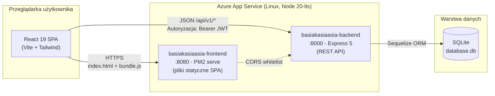

Klient komunikuje się z backendem wyłącznie przez REST/JSON, z tokenem JWT w nagłówku Authorization dla endpointów chronionych.
Backend jest bezstanowy - cała sesja trzymana jest po stronie klienta w sessionStorage.

## 3. Stos technologiczny

### Backend

| Warstwa        | Technologia                      | Wersja            |
| -------------- | -------------------------------- | ----------------- |
| Runtime        | Node.js                          | 20-lts            |
| Framework HTTP | Express                          | ^5.1.0            |
| Język          | TypeScript                       | ^5.9.3            |
| ORM            | Sequelize + sequelize-typescript | ^6.37.7 / ^2.1.6  |
| Baza danych    | SQLite (sqlite3)                 | ^5.1.7            |
| Autentykacja   | jsonwebtoken, bcrypt             | ^9.0.2 / ^6.0.0   |
| Logi           | Winston + Morgan                 | ^3.18.3 / ^1.10.1 |
| CORS           | cors                             | ^2.8.5            |
| Dev            | tsx (watch), ESLint, Prettier    | ^4.20.6           |

### Frontend

| Warstwa       | Technologia                     | Wersja           |
| ------------- | ------------------------------- | ---------------- |
| Runtime       | React + React DOM               | ^19.1.1          |
| Bundler       | Vite                            | ^7.1.7           |
| Routing       | React Router / React Router DOM | ^7.9.4           |
| Język         | TypeScript                      | ~5.9.3           |
| Stylowanie    | TailwindCSS 4                   | ^4.1.16          |
| UI            | Radix UI (15+ komponentów)      | najnowsze        |
| Rich-text     | Lexical                         | ^0.37.0          |
| HTTP          | Axios                           | ^1.12.2          |
| Tabele        | TanStack Table                  | ^8.21.3          |
| Powiadomienia | Sonner                          | ^2.0.7           |
| Ikony         | Lucide / Lucide-React           | ^0.548.0         |
| Daty          | date-fns, react-day-picker      | ^4.1.0 / ^9.11.1 |

### Infrastruktura

| Element | Technologia                                    |
| ------- | ---------------------------------------------- |
| IaC     | Terraform ≥ 1.7 (provider azurerm ~4.0)        |
| Hosting | Azure App Service - Linux, Node 20-lts, SKU B1 |

### Narzędzia dodatkowe

| Element                  | Technologia                             |
| ------------------------ | --------------------------------------- |
| Środowisko developerskie | nix (dev-shell z Node.js i Prettier)    |
| Środowisko do IaC        | nix (dev-shell z Azure CLI i Terraform) |

## 4. Model domenowy

Model bazy danych składa się z pięciu encji powiązanych relacjami 1:N oraz jednej relacji rekurencyjnej (Comment -> parent_comment_id).
ORM Sequelize odzwierciedla je jako klasy z dekoratorami (@Table, @ForeignKey, @BelongsTo, @HasMany).

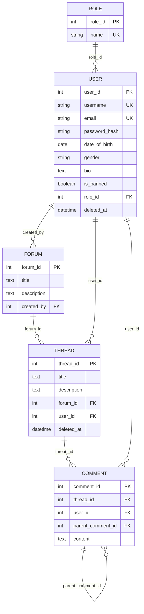

### Znaczenie relacji

- **Role -> User (1:N)** - każdy użytkownik ma dokładnie jedną rolę; domyślnie user.
- **User -> Forum (1:N)** - autor (created_by) forum; widoczny w panelu admina.
- **Forum -> Thread (1:N)** - wątek należy do jednego forum; forum_id jest indeksowane.
- **User -> Thread (1:N)** - autor wątku; soft-delete przez deleted_at.
- **Thread -> Comment (1:N)** - komentarze pierwszego poziomu w wątku.
- **Comment -> Comment (1:N, self-ref)** - odpowiedzi na komentarz; buduje drzewo dyskusji.

### Seed data

backend/src/seed/seedData.ts wypełnia bazę przykładowymi rekordami tylko przy pierwszym uruchomieniu:

- 3 role: user, moderator, admin.
- 10 użytkowników.
- 3 fora.
- 10 wątków.
- Komentarze z odpowiedziami do każdego wątku.

Domyślne konto administratora jest tworzone w na podstawie zmiennych środowiskowych.

## 5. Backend

### Warstwy i przepływ żądania

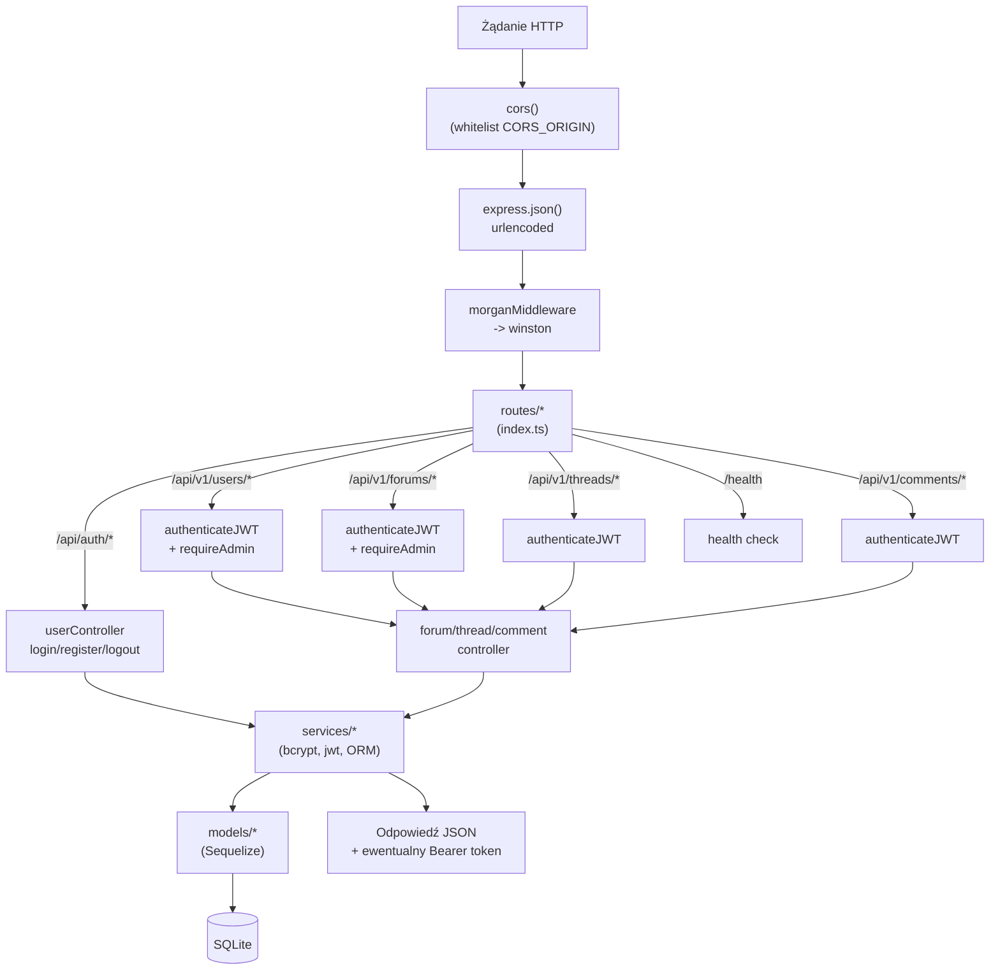

### Bootstrap (src/index.ts)

startServer() wykonuje cztery kroki:

1. connectDatabase() - uwierzytelnienie Sequelize + sync() + ewentualny seed.
2. ensureDefaultRoles() - tworzy role bazowe, jeśli brak.
3. ensureDefaultAdmin() - tworzy konto admin z DEFAULT_ADMIN_PASSWORD.
4. app.listen(PORT) - domyślnie port 8000.

CORS akceptuje listę originów z CORS_ORIGIN.

Logi trafiają do logs/ (Winston: error.log, combined.log) i na konsolę.
Zapytania SQL logowane są tylko w środowisku developerskim przez Morgan.

## 6. API

Wszystkie endpointy (poza /health i /api/auth/\*) są udostępniane pod /api/v1.

### Tabela endpointów

| Metoda | Ścieżka                                  | Auth        | Opis                                                    |
| ------ | ---------------------------------------- | ----------- | ------------------------------------------------------- |
| GET    | /health                                  | -           | Health check + wersja API                               |
| POST   | /api/auth/register                       | -           | Rejestracja                                             |
| POST   | /api/auth/login                          | -           | Logowanie, zwraca JWT                                   |
| POST   | /api/auth/logout                         | -           | Unieważnienie sesji                                     |
| GET    | /api/v1/me                               | JWT         | Profil zalogowanego użytkownika                         |
| GET    | /api/v1/users                            | JWT + admin | Lista wszystkich użytkowników                           |
| GET    | /api/v1/users/id/:id                     | JWT + admin | Użytkownik po ID                                        |
| GET    | /api/v1/users/nickname/:nickname         | JWT + admin | Użytkownik po nicku                                     |
| PUT    | /api/v1/users/:id                        | JWT         | Aktualizacja profilu                                    |
| DELETE | /api/v1/users/:id                        | JWT         | Soft-delete użytkownika                                 |
| POST   | /api/v1/users/:id/ban                    | JWT + admin | Zbanowanie                                              |
| POST   | /api/v1/users/:id/unban                  | JWT + admin | Odbanowanie                                             |
| GET    | /api/v1/forums                           | -           | Lista forów                                             |
| GET    | /api/v1/forums/:id                       | -           | Forum po ID                                             |
| GET    | /api/v1/categories/:categoryId/forums    | -           | Fora w kategorii                                        |
| POST   | /api/v1/forums                           | JWT + admin | Utworzenie forum                                        |
| PUT    | /api/v1/forums/:id                       | JWT + admin | Aktualizacja forum                                      |
| DELETE | /api/v1/forums/:id                       | JWT + admin | Usunięcie forum                                         |
| GET    | /api/v1/threads                          | -           | Lista wątków                                            |
| GET    | /api/v1/threads/:id                      | -           | Wątek po ID                                             |
| GET    | /api/v1/forums/:forumId/threads          | -           | Wątki w forum                                           |
| GET    | /api/v1/users/:userId/threads            | -           | Wątki użytkownika                                       |
| POST   | /api/v1/threads                          | JWT         | Utworzenie wątku                                        |
| PUT    | /api/v1/threads/:id                      | JWT         | Aktualizacja wątku                                      |
| DELETE | /api/v1/threads/:id                      | JWT         | Soft-delete wątku                                       |
| GET    | /api/v1/threads/:threadId/comments       | -           | Komentarze w wątku                                      |
| GET    | /api/v1/threads/:threadId/comments/stats | -           | Statystyki komentarzy                                   |
| GET    | /api/v1/comments/:id                     | -           | Komentarz po ID                                         |
| GET    | /api/v1/comments/:commentId/replies      | -           | Odpowiedzi na komentarz                                 |
| GET    | /api/v1/users/:userId/comments           | -           | Komentarze użytkownika                                  |
| POST   | /api/v1/comments                         | JWT         | Utworzenie komentarza (z opcjonalnym parent_comment_id) |
| PUT    | /api/v1/comments/:id                     | JWT         | Aktualizacja komentarza                                 |
| DELETE | /api/v1/comments/:id                     | JWT         | Usunięcie komentarza                                    |

### Middleware autoryzacji

- authenticateJWT - weryfikuje Authorization: Bearer <token> przez (jwt.verify + secret). W razie błędu zwraca 401.
- requireRole(roleId) / requireAdmin (requireRole(3)) - sprawdza req.user.roleId; brak roli => 403 Forbidden.
- optionalAuthentication - parsuje token, jeśli obecny, ale nie wymaga go.

### Przepływ logowania

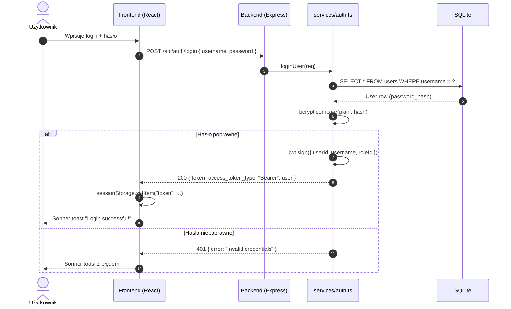

## 7. Frontend

### Routing i ochrona tras

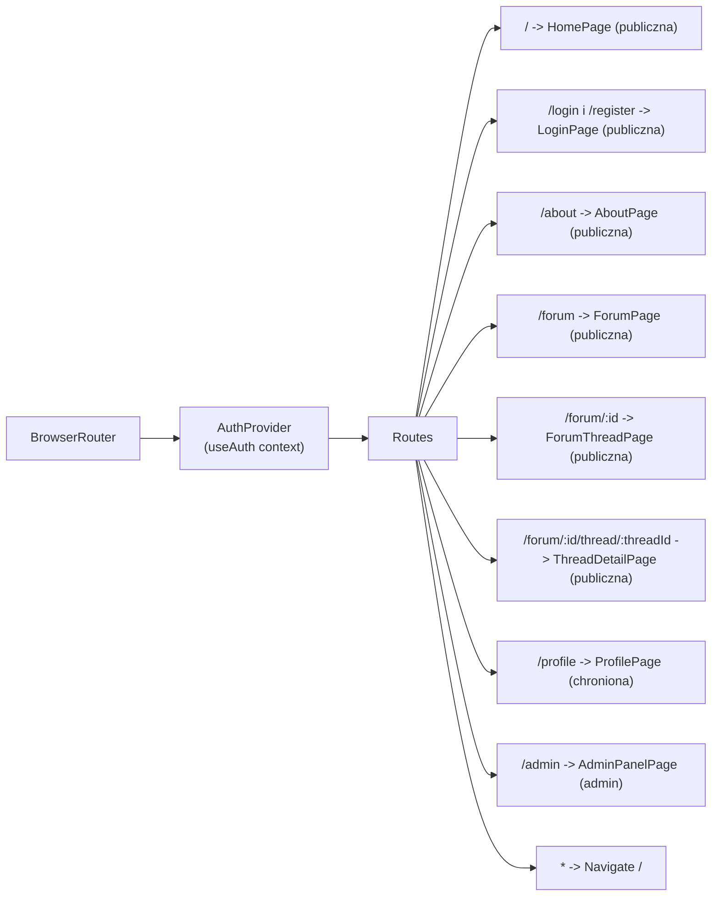

Wzorzec ProtectedRoute sprawdza autoryzację i przekierowuje na /login w razie braku odpowiednich uprawnień.

### Klient HTTP i interceptor

services/api.ts tworzy instancję axios z baseURL = ${VITE_API_BASE_URL}/api/v1.
Interceptor request automatycznie dodaje nagłówek:

```ts
config.headers['Authorization'] = ${access_token_type} ${token};
```

gdzie token i access_token_type są przechowywane w sessionStorage.

### State machine autoryzacji

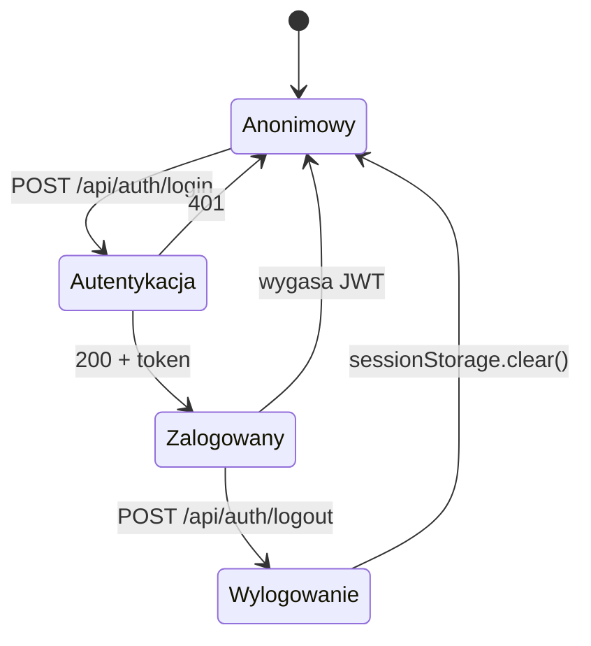

## 8. Bezpieczeństwo

- **Hasła:** bcrypt z kosztem 10.
- **JWT:** jsonwebtoken, algorytm domyślny (HS256), JWT_SECRET pobierany z env, czas życia domyślnie 24h.
  Claims: { userId, username, email, roleId }.
- **RBAC:** warstwa middleware/auth.ts pilnuje endpointów administracyjnych.
- **CORS:** whitelist originów z CORS_ORIGIN. Na Azure ustawiony na hostname frontendu, więc przeglądarka nie zezwoli na obce domeny.
- **Walidacja danych wejściowych:** podstawowa w kontrolerach (parsowanie req.body, sprawdzanie Object.keys, walidacja długości).
- **Bezpieczeństwo transportu:** HTTPS wymuszany przez Azure App Service (domyślny certyfikat \*.azurewebsites.net).
- **Soft-delete:** wątki i użytkownicy nie są kasowani fizycznie - ustawiane jest deleted_at.

## 9. Infrastruktura Azure

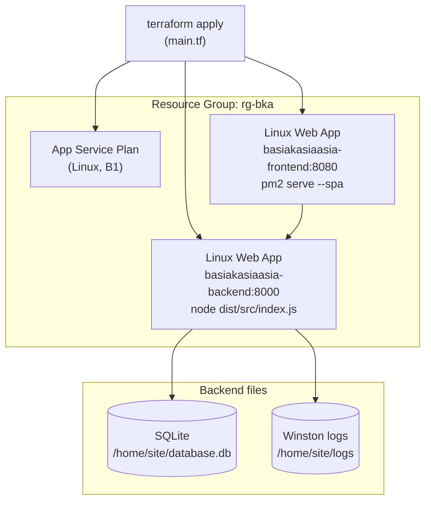

### Deploy

Proces wdrożenia składa się z kroków:

1. **terraform init && terraform apply --auto-approve** - tworzy RG, plan, oba Web Appy.
2. Skrypt **update-backend** - buduje backend (npm ci && npm run build), pakuje wymagane pliki w zip i publikuje przez az webapp deploy.
3. Skrypt **update-frontend** - buduje frontend (npm ci && npm run build) analogicznie pakuje wymagane pliki i publikuje aplikację.

Alternatywnie **update-app** wywołuje oba update-\*.sh po kolei.

## 10. Rozwój lokalny

### Wymagania

- Node.js 20.x.
- npm 10+ (lockfile package-lock.json).
- Azure CLI + Terraform.

Pliki flake.nix zawierają definicję środowiska developerskiego.
.envrc automatycznie ładuje zmienne środowiskowe przy odpowiednio skonfigurowanym direnv.

### Pierwsza konfiguracja

Wypelnienie plików .env na podstawie .env.example w obu katalogach:

```bash
# 1. Backend
cp backend/.env.example backend/.env
# 2. Frontend
cp frontend/.env.example frontend/.env
```

(Opcjonalnie) Wejście w nix-shell

```
nix develop
```

### Zmienne środowiskowe

backend/.env:

- PORT=8000
- NODE_ENV=development
- JWT_SECRET=change-this-in-production
- JWT_EXPIRES_IN=24h
- DEFAULT_ADMIN_PASSWORD=admin123
- DB_PATH=backend/db/database.db
- CORS_ORIGIN=http://localhost:5173

frontend/.env:

- VITE_API_BASE_URL=http://localhost:8000

## 11. Przepływy użytkownika

### 11.1. Przeglądanie forów

Gość wchodzi na /forum i widzi listę forów wraz z autorem i datą utworzenia.
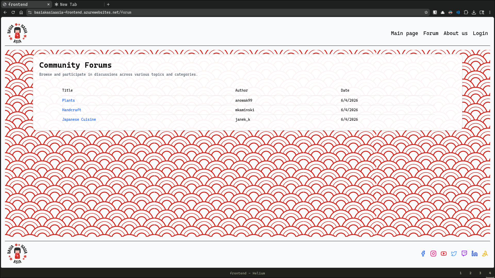

### 11.2. Logowanie i toast

Po udanym POST /api/auth/login

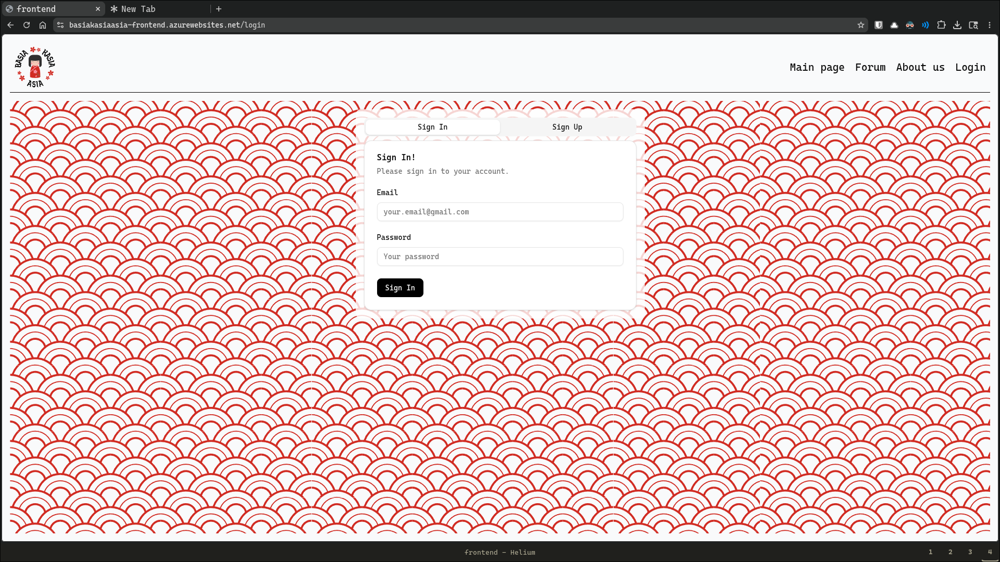

frontend wyświetla toast Sonner _"Login successful!"_ i zapisuje token w sessionStorage. Od tego momentu interceptory axios automatycznie dołączają nagłówek Authorization.

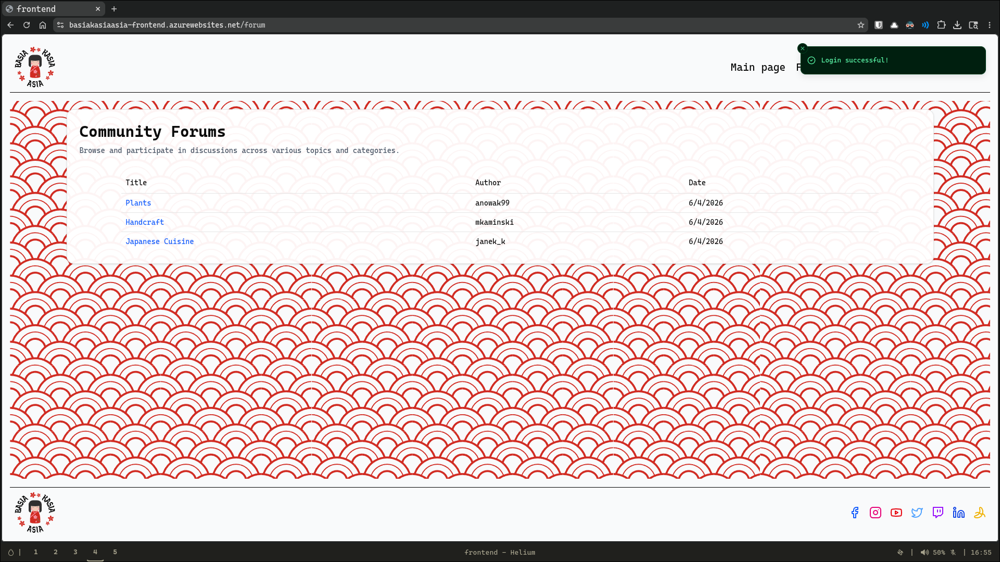

### 11.3. Czytanie wątku i komentarze

Wątek pobiera dane z GET /api/v1/threads/:id, a komentarze z GET /api/v1/threads/:threadId/comments. Renderowany jest autor, data, treść pierwszego posta oraz drzewo komentarzy z awatarami.

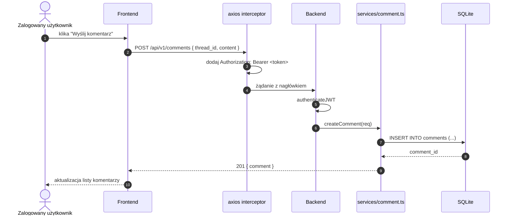

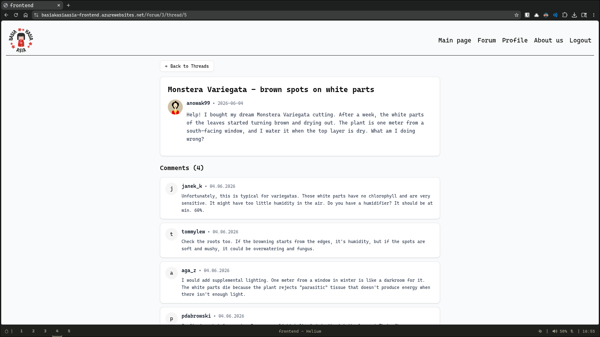

### 11.4. Panel administracyjny

Administrator wchodzi na /admin. Strona posiada dwie zakładki **Users** i **Forums**. 
W zakładce Users możliwe jest banowanie, odbanowywanie i dodanie nowych administratorów.
W zakładce Forums możliwe są dodanie, edycja i usunięcie forum.

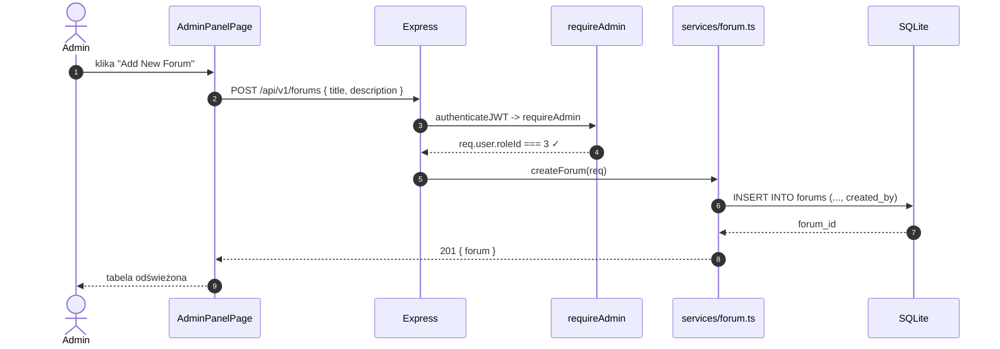

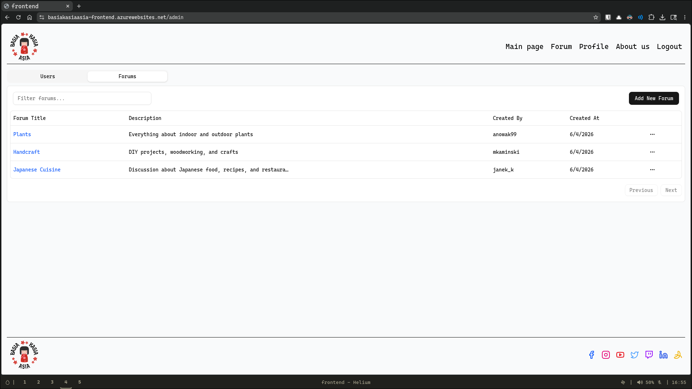
